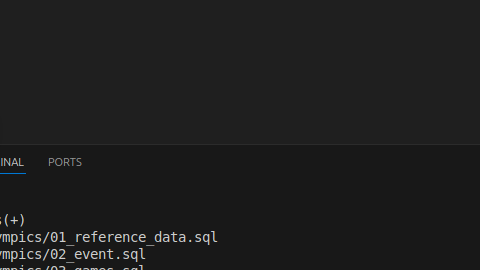

# Instalar docker 

##  comandos pa instalar

```bash
curl -fsSL https://get.docker.com -o get-docker.sh
sudo sh get-docker.sh
```

## poner a docker como super usuario
```bash

sudo usermod -aG docker $USER
```


## Crear archivos para el server de phpMyAdmin

### crear el .env

```bash
MYSQL_ROOT_PASSWORD=rootpassword
MYSQL_DATABASE=mydb
MYSQL_USER=user
MYSQL_PASSWORD=password
```
### crear el docker-compose.yml

```bash
version: '3.8'

services:
    mysql:
    image: mysql:8.0
    container_name: mysql
    environment:
        - MYSQL_ROOT_PASSWORD=${MYSQL_ROOT_PASSWORD}
        - MYSQL_DATABASE=${MYSQL_DATABASE}
        - MYSQL_USER=${MYSQL_USER}
        - MYSQL_PASSWORD=${MYSQL_PASSWORD}
    ports:
        - "3307:3306"
    volumes:
        - ./dbdata:/var/lib/mysql

    phpmyadmin:
    image: phpmyadmin/phpmyadmin
    container_name: phpmyadmin
    environment:
        - PMA_HOST=mysql
        - PMA_USER=${MYSQL_USER}
        - PMA_PASSWORD=${MYSQL_PASSWORD}
    ports:
        - "8081:80"
    depends_on:
        - mysql

```
##  levanta el servidor

```
		docker compose up -d
```





